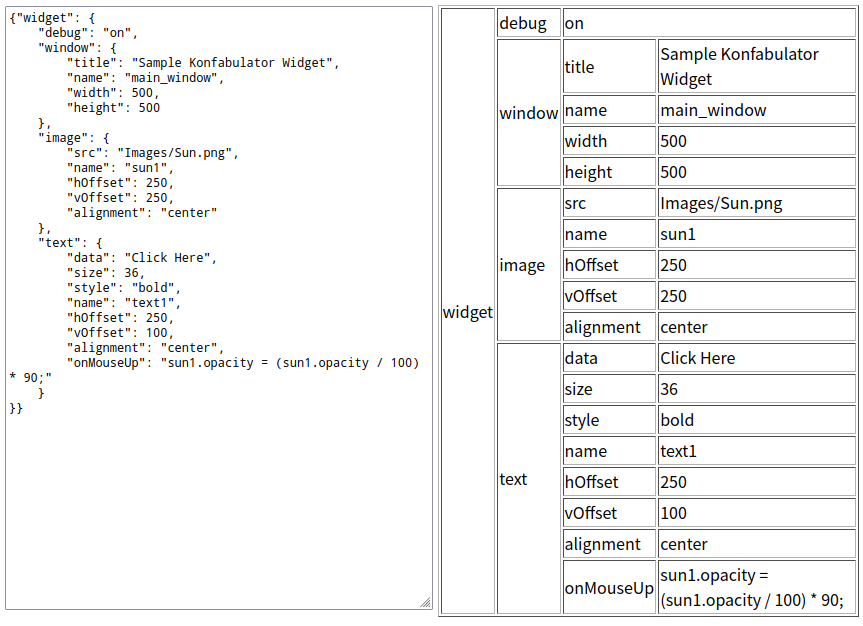

# json table viewer

render json to table



## Installation

```bash
npm install @sinm/json-table-viewer
# or
yarn add @sinm/json-table-viewer
```

## Usage
```tsx
import { JSONTableViewer } from '@sinm/json-table-viewer';

<JSONTableViewer json={json} />
```

## Props (extends table props)
| Prop        | Type                       | Required | Description           |
| ----------- | -------------------------- | -------- | --------------------- |
| json        | any                        | true     | data to render        |
| renderKey   | (key: string) => ReactNode | false    | custom key renderer   |
| renderValue | (value: any) => ReactNode  | false    | custom value renderer |
| className   | string                     | false    | table class name      |
| style       | string                     | false    | table style           |